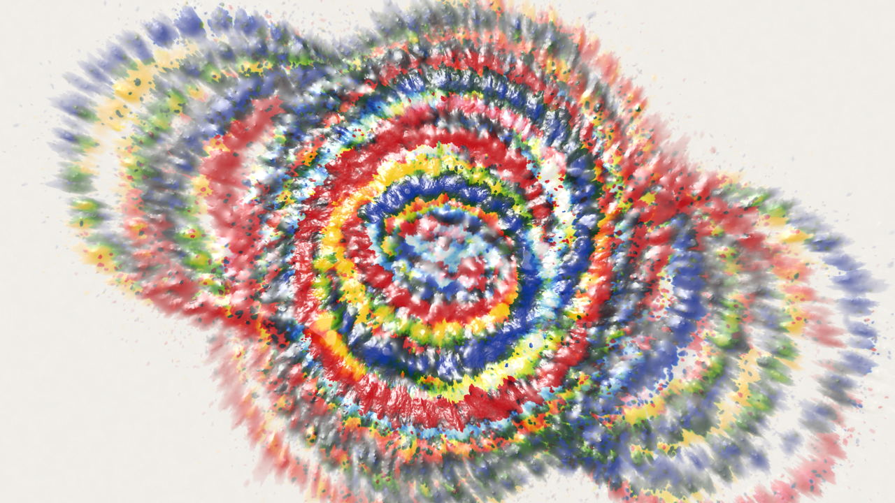
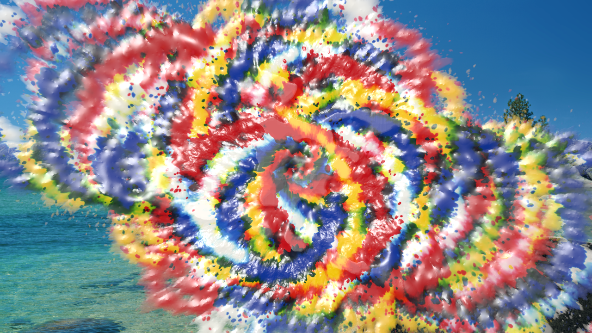

# SwingPaint 🪣

**Turn your desktop into a pendulum paint-pour canvas.**

Paint recreates those mesmerizing pendulum-painting videos — a bucket of paint
hanging from a rope, swinging and spinning over a canvas, spraying ribbons of
color into spiral rosettes — except the canvas is your Mac's desktop.

Click the bucket in your menu bar: the desktop fades away, a full bucket swings
in, and physics does the rest. When the paint runs out, the artwork lingers for
a moment, then everything fades gracefully back to your normal desktop.



## How it plays

- **Launch the app** (or click its Dock / menu bar icon) and the desktop fades
  into a canvas while the bucket swings in, already pouring.
- **Grab the bucket** with the mouse — even mid-swing — and fling it. A curved
  flick adds spin; the scroll wheel over the bucket spins it harder.
- **Smear the paint**: drag anywhere on the canvas to mush wet paint around
  with your cursor.
- **The session ends itself** when the bucket runs dry, fading your desktop
  back — or end it early with the ⨉ on the control rail or the menu bar icon.

The control rail (top right) has stop/refill/clear at hand, paint-level gauges
you can click to refill, and a **More** panel with colors, palettes, canvas
color, flow, viscosity, side spray, rope length, swing limits, and more.

### Paint on your actual wallpaper

The renderer can use your current wallpaper as the canvas instead of a solid
color, so the bucket genuinely splatters *your desktop*. This captures the live
wallpaper via ScreenCaptureKit and asks once for the Screen Recording
permission.



## Why the paint looks real

This is not a particle sprite demo — the paint model is the heart of the app:

- **Kubelka–Munk pigment mixing.** Colors blend in absorption/scattering space,
  so yellow + blue makes *green*, not gray mud. Fresh paint *covers* the layer
  beneath, mixing only with a thin surface film — exactly like wet acrylic.
- **A wet surface, relit.** The canvas keeps a height + wetness field. Normals
  derived from the paint's height give every splat a glossy specular sheen;
  fresh paint self-levels briefly, then its relief freezes in and keeps
  catching the light.
- **Real droplet ballistics.** Every droplet is a particle integrated on the
  GPU. Fast impacts stretch into streaks and eject satellite micro-splatter;
  streams weaken as chambers drain (Torricelli outflow) and sputter out.
- **A real pendulum.** The bucket is a spherical pendulum with spin — paint is
  flung outward by rotation and lands farther at the swing's edges, producing
  the classic looping rosettes.
- **Procedural sound.** The splatter plops are synthesized at launch (no audio
  assets): pitch-bending drip bodies with bubble chirps, timed to droplet
  flight so they land with the paint.

Everything heavy runs in Metal: droplet integration, impact detection, splat
stamping with framebuffer-fetch pigment blending, wet-surface relaxation, and
the relit present pass. The CPU only steps the pendulum and feeds droplets.

## Building

Requirements: **Xcode 26+** on Apple silicon (the Metal shader toolchain is a
one-time `xcodebuild -downloadComponent MetalToolchain` if missing).

```sh
git clone https://github.com/kindparkllc/SwingPaint.git
open Paint.xcodeproj   # build & run the Paint scheme
```

The app runs as a resident desktop-painting app: no main window, an optional
menu bar icon (toggleable in the controls panel), and sessions layered just
above your wallpaper but below your working windows — painting never
interrupts work.


---

*Made with Metal, a pendulum, and an unreasonable amount of paint-look tuning.*
